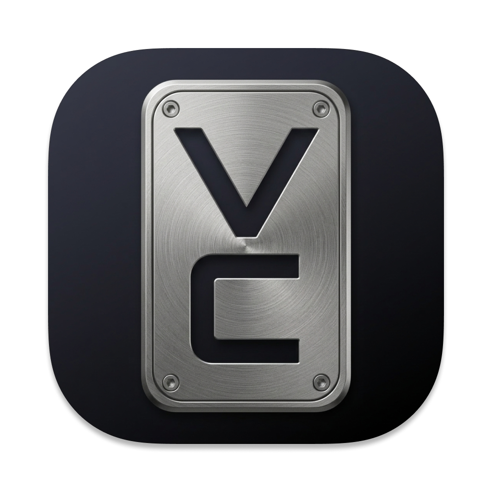

# VoiceClutch

Private, on-device voice dictation for macOS with low-latency streaming transcription and an optional LLM-powered corrections.

- **Stay in flow** - Dictate naturally with low-latency streaming and quick text injection into any active app.
- **Get cleaner output** - Optional LLM final pass improves punctuation, structure, and readability before insertion.
- **Keep your data local** - Speech recognition and transcript cleanup run on-device for privacy-first usage.

## Features

### Dictation Workflow & Controls

- **Menu bar app** - Runs as a lightweight macOS status bar utility with quick access to controls and preferences.
- **Flexible interaction modes** - Choose between `Hold-to-talk` and `Press-to-talk` based on your workflow.
- **Configurable listening shortcut** - Set a preferred modifier key or create a custom key combination.

### Productivity Helpers

- **Media pause/resume** - Optionally pauses active macOS media playback while dictating and resumes after.
- **Clipboard recovery** - Restores your previous clipboard contents after dictation injection.
- **Microphone chimes** - Optional start/stop sounds for listening state feedback.
- **Vocabulary manager** - Add manual replacements, review learned corrections, and import/export vocabulary JSON.

### Local Intelligence & Privacy

- **On-device processing** - Speech recognition and transcript post-processing run locally on your Mac.
- **Optional LLM final pass** - Enable local transcript cleanup and formatting refinement.
- **Optional clipboard context** - Allow clipboard-aware formatting context for the final pass.
- **Privacy-first behavior** - VoiceClutch does not collect analytics or usage telemetry.

## Getting Started

1. Use the menu bar icon to confirm VoiceClutch is ready.
2. Press and hold the default shortcut `Left Option` to dictate in hold-to-talk mode.
3. Release to finish dictation and inject text into the active field.
4. Open `Preferences` from the menu bar to change shortcut, interaction mode, and optional features.

## Acknowledgements

- [FluidInference Nvidia Nemotron Speech Streaming 0.6b CoreML](https://huggingface.co/FluidInference/nemotron-speech-streaming-en-0.6b-coreml) - An on-device streaming ASR model used by VoiceClutch for low-latency speech-to-text dictation.
- [LFM2.5-1.2B-Instruct-MLX-4bit](https://huggingface.co/lmstudio-community/LFM2.5-1.2B-Instruct-MLX-4bit) - A compact MLX instruction model used by VoiceClutch for local transcript cleanup and optional smart-formatting passes.
- [mlx-swift-lm](https://github.com/ml-explore/mlx-swift-lm) - Swift tooling for loading and running MLX language models. VoiceClutch relies on it to execute local LLM inference.
- [Apple Frameworks](https://developer.apple.com/documentation) - CoreAudio handles audio I/O, AVFoundation coordinates media capture, CoreML runs model inference, CoreGraphics supports rendering primitives, and AppKit powers the native macOS interface.

## Feedback & Contributions

For issues, suggestions, or feature requests, please [open an issue](../../issues).

## License

[MIT License](LICENSE)
